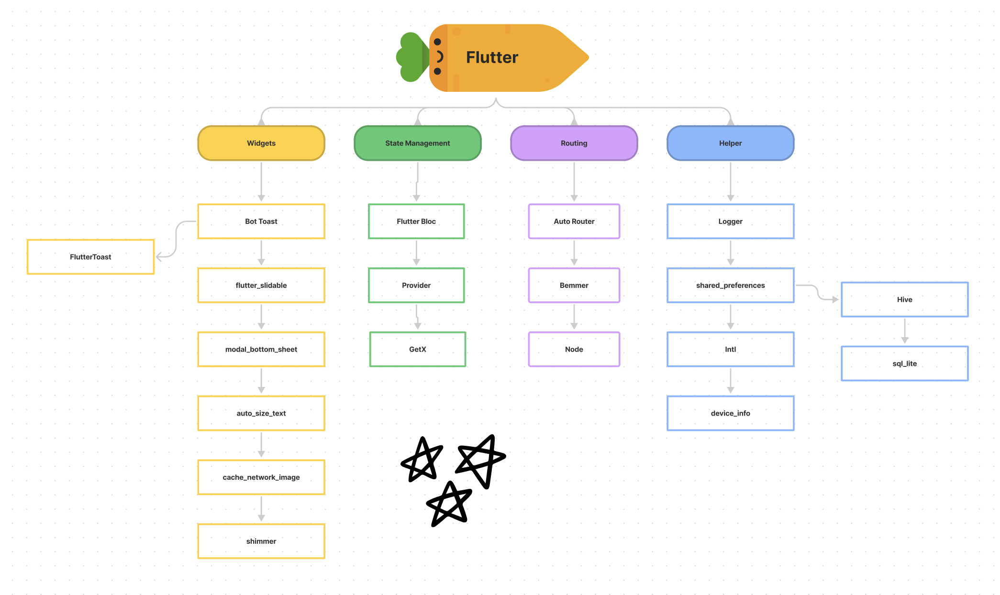
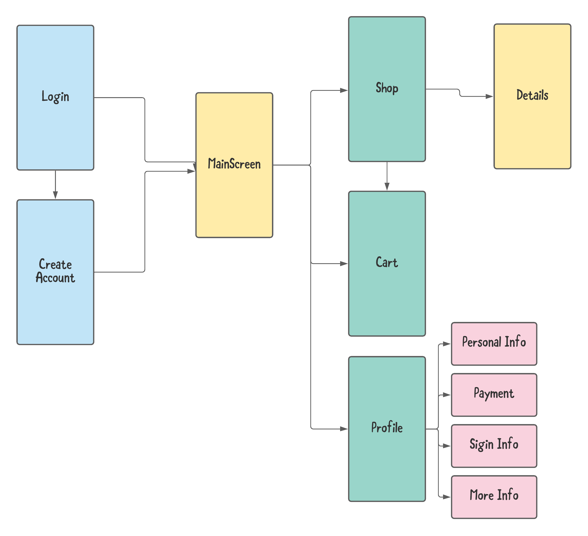
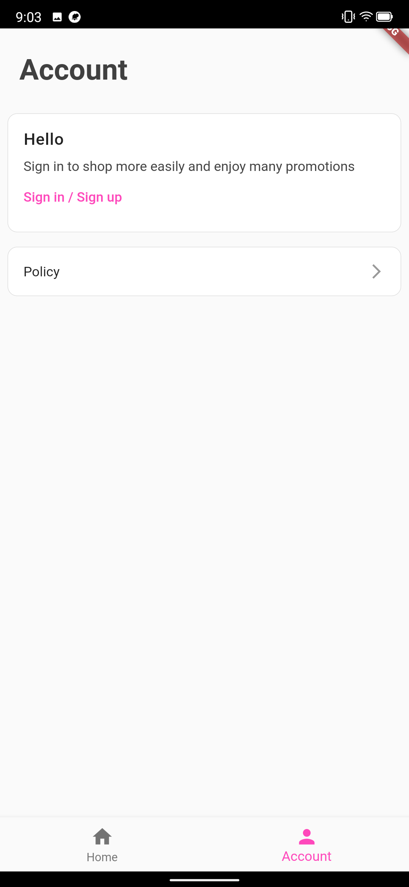
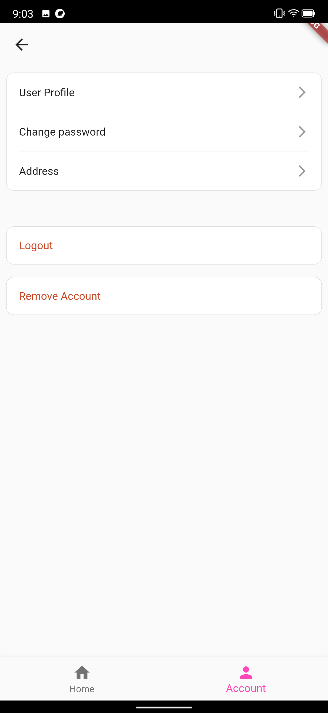
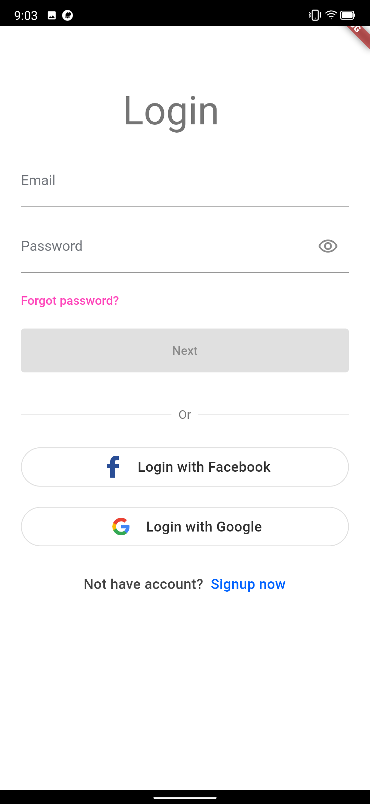

# Flutter Boilerplate

Fork this project then start you project with a lot of stuck prepare

Base project made with much: . Contains Bloc, Route, and much more!

## Table of contents

- [How to Use](#how-to-use)
- [Code Conventions](#code-conventions)
- [Dependencies](#dependencies)
- [Code structure](#code-structure)

## Prerequisites

- Flutter: >=3.7.0 <4.0.0
- [Firebase staging](https://console.firebase.google.com/u/0/project/flutter-app-ec8dd/settings/iam)
- [Firebase prod](https://console.firebase.google.com/u/0/project/template-app-prod-3a034/settings/iam)

## How to Use

## Run this template

1. Download or clone this repo by using the link below:

    ```
    https://github.com/GoldenOwlAsia/mobile-flutter-template.git
    ```

2. Go to project root and execute the following command in console to get the required dependencies:

    ```
    flutter pub get
    ```

3. Now run the generator

    ```
    flutter packages pub run build_runner build
    ```

4. To run staging project

    ```
    flutter run --flavor staging --target lib/main_staging.dart
    ```

5. To run production project

    ```
    flutter run --flavor production --target lib/main_production.dart
    ```

## Use this template to create your project

1. Download or clone this repo by using the link below:

      ```
      https://github.com/GoldenOwlAsia/mobile-flutter-template.git
      ```

2. Go to project root and execute the following command in console to update this project config
    ```sh
    sudo sh ./customizer.sh your.package.name
    ```
- [x] Remove git, update readme
- [x] Change your bundle-id

3. Change your app builder id (iOS & Android)

- Replace/Update your firebase config as your project.
  - Android staging: `android/app/src/staging/google-services.json`
  - Android production: `android/app/src/production/google-services.json`
  - iOS staging: `ios/config/GoogleService-Info.plist`
  - iOS production: `ios/config/GoogleService-Info.plist`
  - Update `firebase_options_prod.dart`
  - Update `firebase_options_stg.dart`
  - Update `REVERSED_CLIENT_ID` on file info.plist

4. Update Firebase config - by run command
    ```
    flutterfire config \
      --project={YOUR_FIREBASE_ID_PROJECT} \
      --out={part to save firebase_options.dart} \
      --ios-bundle-id={BUNDLE_ID_APP} \
      --android-app-id={APP_ID}
    ```
    -> [Read More here](https://github.com/GoldenOwlAsia/mobile-flutter-template/wiki/Flavors)

5. [Try to run this code](#run-this-template)

# Code Conventions

- [analysis_options.yaml](analysis_options.yaml)
- [About code analytics flutter](https://medium.com/flutter-community/effective-code-in-your-flutter-app-from-the-beginning-e597444e1273)

  In Flutter, Modularization will be done at a file level. While building widgets, we have to make sure they stay independent and re-usable as maximum. Ideally, widgets should be easily extractable into an independent project.

- Must know
  - Model name start with `M`: MUser, MProduct, MGroup...
  - Common widget start with `X`: XButton, XText, XAppbar... - There widget under folder `lib/widgets/`
  - App Constants class or service start with `Add`: AppStyles, AppColor, AppRouter, AppCoordinator,.. and UserPrefs

# Dependencies



## Helper

- [logger](https://pub.dev/packages/logger): Small, easy to use and extensible logger which prints beautiful logs.

- [url_launcher](https://pub.dev/packages/url_launcher): A Flutter plugin for launching a URL in the mobile platform. Supports iOS, Android, web, Windows, macOS, and Linux.

- [auto_route](https://pub.dev/packages/auto_route): Auto route generator, Manager router

- [get_it](https://pub.dev/packages/get_it): This is a simple Service Locator

- [intl](https://pub.dev/packages/intl): This package provides internationalization and localization facilities, including message translation, plurals and genders, date/number formatting and parsing, and bidirectional text.

- [shared_preferences](https://pub.dev/packages/shared_preferences): Flutter plugin for reading and writing simple key-value pairs. Wraps NSUserDefaults on iOS and SharedPreferences on Android.

- [package_info_plus](https://pub.dev/packages/package_info_plus): This Flutter plugin provides an API for querying information about an application package.

- [device_info_plus](https://pub.dev/packages/device_info_plus): Get current device information from within the Flutter application.

- [permission_handler](https://pub.dev/packages/permission_handler): Permission plugin for Flutter. This plugin provides a cross-platform (iOS, Android) API to request and check permissions.

## HTTP, API

- [http](https://pub.dev/packages/http): A composable, Future-based library for making HTTP requests.

## Flutter Fire

> The official Firebase plugins for Flutter. sign_in, analytics, crashlytics, storage, firestore

- [Flutter Fire](https://firebase.flutter.dev/)

## State Management

> State Management is still the hottest topic in Flutter Community. There are tons of choices available and it’s super intimidating for a beginner to choose one. Also, all of them have their pros and cons. So, what’s the best approach

**A recommended approach**

- [flutter_bloc](https://pub.dev/packages/flutter_bloc): Widgets that make it easy to integrate blocs and cubits into Flutter. [Learn more](https://bloclibrary.dev/#/)

## Flutter Gen

- [flutter_gen](https://pub.dev/packages/flutter_gen): The Flutter code generator for your assets, fonts, colors, … — Get rid of all String-based APIs.

## Localization

- [localization](https://pub.dev/packages/localization): Package to simplify in-app translation.

## Widget

- [shimmer](https://pub.dev/packages/shimmer): Shimmer loading animation
- [flutter_html](https://pub.dev/packages/flutter_html)
- [webview_flutter](https://pub.dev/packages/webview_flutter)

## Image

- [cached_network_image](https://pub.dev/packages/cached_network_image)
- [flutter_cache_manager](https://pub.dev/packages/flutter_cache_manager)

# Code structure

Here is the core folder structure which flutter provides.

```
flutter-app/
|- android
|- ios
|- web
|- lib
|- modules
|- test
```

Here is the folder structure we have been using in this project

```
lib/
|- packages/
|- src/
  |- data/
  |- services/
  |- feature/
    |- dashboard/
      |- widget/
      |- controller
      |- dashboard_screen.dart
    |- home/
    |- login/
  |- plugins/
  |- routing/
|- widgets/
  |- button/
  |- image/
  |- view/
|- main.dart
|- modules
```

## Navigation Stack



## Wiki

Checkout [wiki](https://github.com/GoldenOwlAsia/mobile-flutter-template/wiki) for more info

## Screenshot

| Account                                              | Profile                                              | Login                                              |
| ---------------------------------------------------- | ---------------------------------------------------- | -------------------------------------------------- |
|  |  |  |
